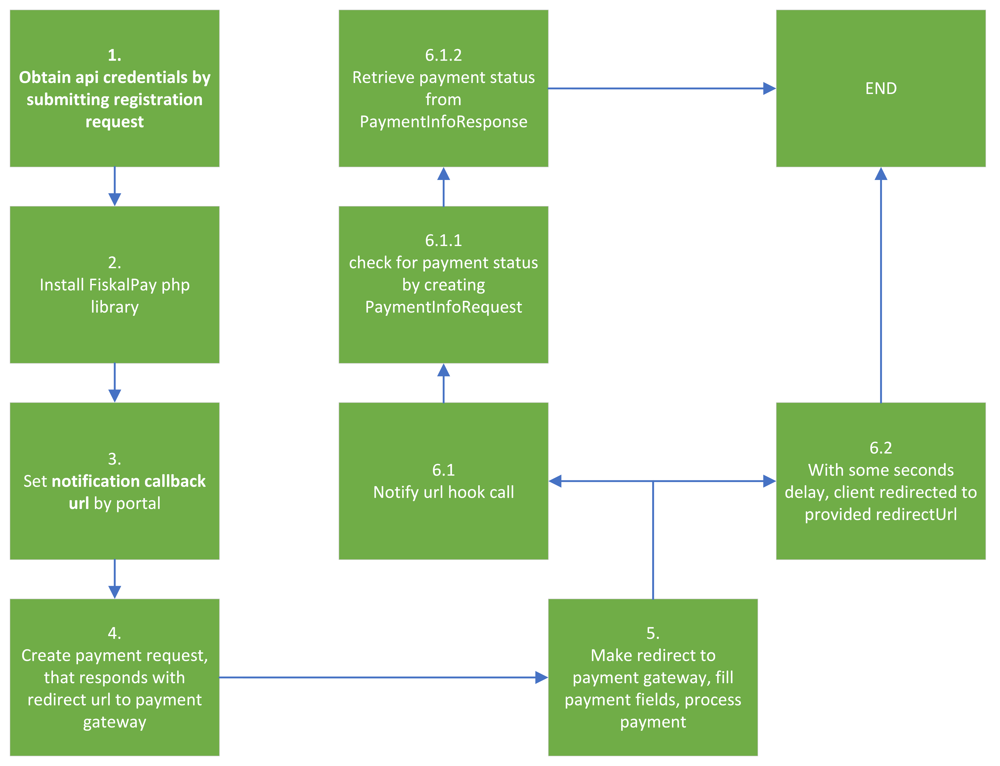

#####
Usage
#####

.. note::
    We will use code snippets from tests to demonstrate how to use this library.

.. hint::
    The core of this package is :php:class:`A3Soft\A3PayPhpClient\PaymentGatewayApi\PaymentGatewayRequester` service.

    All classes from namespace :php:namespace:`A3Soft\A3PayPhpClient\Helper` are just data models required to make API request.

Lifetime cycle
##############

.. raw:: html
    

.. raw:: html
    

----------

Overview
########

.. note::
    If we want to construct `PaymentGatewayRequester` service, we need **url link** and **access token**

The :php:class:`A3Soft\A3PayPhpClient\PaymentGatewayApi\PaymentGatewayRequester` service has one purpose. Processing requests to payment api and returning responses. Once the service is created, it has only one method
:php:method:`A3Soft\A3PayPhpClient\PaymentGatewayApi\PaymentGatewayRequester::makeRequest()`.
Method can create payment request with provided data in array type (this can be useful, when you want to handle data on your own), or class that implements :php:interface:`A3Soft\A3PayPhpClient\Helper\PaymentGatewayApi\Request\PaymentGatewayRequest`.
For standard scenario we have prepared two helper classes, which implements :php:interface:`A3Soft\A3PayPhpClient\Helper\PaymentGatewayApi\Request\PaymentGatewayRequest`.

- :php:class:`A3Soft\A3PayPhpClient\Helper\PaymentGatewayApi\Request\PaymentRequest`
- :php:class:`A3Soft\A3PayPhpClient\Helper\PaymentGatewayApi\Request\PaymentInfoRequest`

This classes extends :php:class:`A3Soft\A3PayPhpClient\Util\AbstractToArray`, it means they can cast all properties to array.

:php:method:`A3Soft\A3PayPhpClient\PaymentGatewayApi\PaymentGatewayRequester::makeRequest()` method returns :php:class:`A3Soft\A3PayPhpClient\Helper\PaymentGatewayApi\Response\CurlResponse` object in case no curl error has occurred.

When a curl error has occurred, the :php:class:`A3Soft\A3PayPhpClient\Exception\CurlRequestException` is thrown.
It has :php:method:`A3Soft\A3PayPhpClient\Exception\CurlRequestException::getCurlResponse()` method, which retrieves :php:class:`A3Soft\A3PayPhpClient\Helper\PaymentGatewayApi\Response\CurlResponse` object.

We can check for error message by calling :php:method:`A3Soft\A3PayPhpClient\Helper\PaymentGatewayApi\Response\CurlResponse::getErrorMessage()`. This method returns null if no error occurred, else error message in string.

If we want to check http response code, we need to call :php:method:`A3Soft\A3PayPhpClient\Helper\PaymentGatewayApi\Response\CurlResponse::getStatusCode()`.

In case we want to get raw body we will call :php:method:`A3Soft\A3PayPhpClient\Helper\PaymentGatewayApi\Response\CurlResponse::getBody()`, or its json parsed variant :php:method:`A3Soft\A3PayPhpClient\Helper\PaymentGatewayApi\Response\CurlResponse::json()`, which returns parsed response data in array.

In this step, we should validate response data.

For this purpose we can use Response data model classes.

- :php:class:`A3Soft\A3PayPhpClient\Helper\PaymentGatewayApi\Response\PaymentResponse` - represents data from PaymentRequest
- :php:class:`A3Soft\A3PayPhpClient\Helper\PaymentGatewayApi\Response\PaymentInfoResponse` - represents data from PaymentInfoRequest

Both of this classes implements `fromArray()` method, so we can easy pass data from :php:class:`A3Soft\A3PayPhpClient\Helper\PaymentGatewayApi\Response\CurlResponse` using :php:method:`A3Soft\A3PayPhpClient\Helper\PaymentGatewayApi\Response\CurlResponse::json()` method.

PaymentGatewayRequester service
===============================

.. code-block:: php
    :caption: example.php
    :linenos:

    <?php

        $paymentGatewayRequester = new PaymentGatewayRequester('https://api_url_from_registration_request', 'token_from_registration_request');

We have implemented two types of request:

- :doc:`Payment request`
- :doc:`Info request`

-------

Table of contents:
==================

.. toctree::
    :maxdepth: 1

    making-payment-request
    making-payment-info-request
    payment-notify-handling