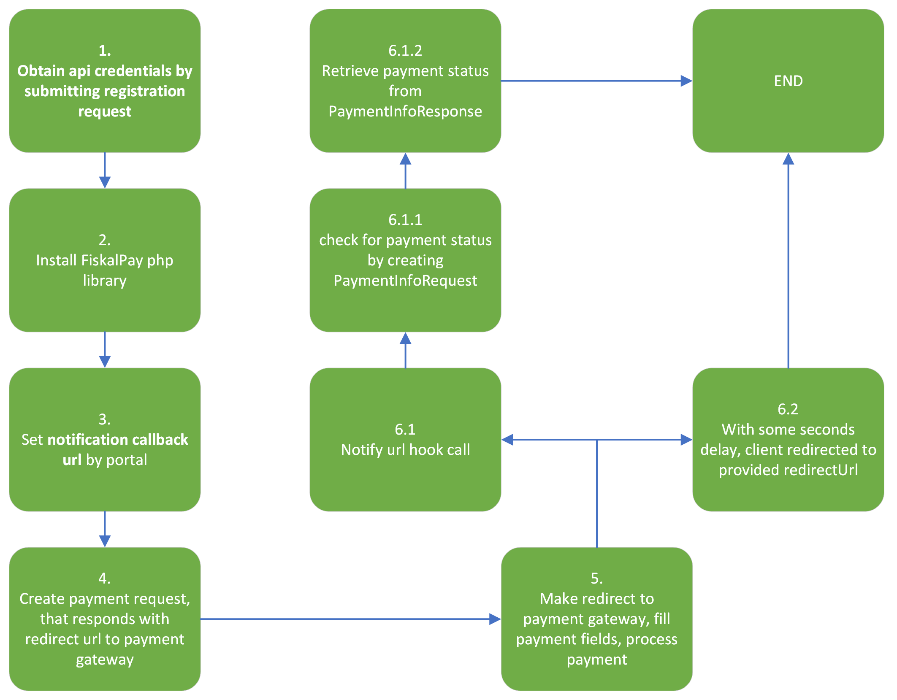

###############
Getting started
###############

Overview
========
.. note::
    This package provide an easy way to integrate FiskalPay payment gateway.

    It consists from prepared data models for every request, response, and service which is processing a requests and returning a responses.

Lifetime cycle
++++++++++++++
#. Obtain api credentials by :ref:`submitting registration request<Registration request>`
#. :ref:`Install library<Installation>`
#. Set **notification callback url** by portal
#. Create payment request, that responds with redirect url to payment gateway
#. Make redirect to payment gateway, fill payment fields, process payment
#. In the moment, when the payment will be processed, payment gateway engine will call **notifyUrl** hook and some seconds later client will be redirected to **redirectUrl** you provided before.
    - When notification hook is called you receive **paymentId** and **status**, but it is **important** to check for status by creating :ref:`PaymentInfoRequest<Info request>`, because of security reasons.
    - Info request will return a status of payment and you can set state to your order.

----------

.. raw:: html
    

.. raw:: html
    

----------

.. note::
    For usage check :ref:`Usage section<Usage>`

.. toctree::
    :maxdepth: 3

    registration
    installing
